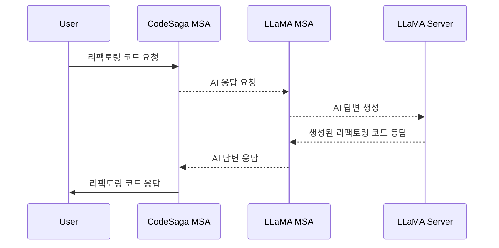
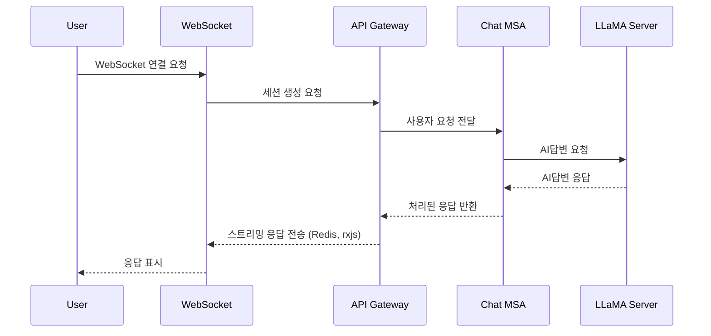

# CodeSaga AI 서비스

### 🛠 기술 스택

| 컴포넌트         | 기술 스택                                             |
| ---------------- | ----------------------------------------------------- |
| **Extension**    | TypeScript, Cursor API                                |
| **Backend**      | NestJS (MSA), WebSocket, REST API, gRPC, Redis        |
| **LLM**          | OLLAMA3 8B (`llama-3-Korean-Bllossom-8B-gguf-Q4_K_M`) |
| **Infra**        | AWS EC2, Redis, Docker, Kafka (Saga Pattern)          |
| **Architecture** | Hexagonal Architecture                                |

### 1. 개요

**CodeSaga**는 개발자를 위한 Cursor 확장 프로그램으로, **코드 보완 및 리팩토링을 지원하는 Cursor 확장 기능**을 제공합니다.  
Meta의 **OLLAMA3 8B (`llama-3-Korean-Bllossom-8B-gguf-Q4_K_M`)** 모델을 기반으로 동작하며, AWS EC2에서 실행되는 NestJS 서버를 통해 요청을 처리합니다.

### 2. 목표 및 핵심 기능

### 🚀 핵심 기능

### 1. GENERATE : 독립적인 한 번의 응답



### 2. CHAT : 이전 대화를 기억하는 스트리밍 응답



### 🎯 목표

- **코드 작성 및 보완 지원**
- **코드 스타일 및 리팩토링 제안**
- **Cursor와 유사한 자연스러운 코드 자동완성 기능 제공**

### 3. 시스템 아키텍처

### 🏗 아키텍처 개요

CodeSaga는 Code Extension과 NestJS 기반의 서버, 그리고 LLaMA 모델이 결합된 구조로 동작합니다.

```plaintext
+------------------------+
|   Code Extension       |
| (사용자 입력 및 결과 표시)   |
+------------------------+
          |
          | WebSocket / REST API 요청
          v
+------------------------+
|      API GATEWAY       |
|                        |
+------------------------+
          |
          | GRPC 요청
          v
+------------------------+
|      NestJS 서버        |
|   (요청 처리 및 모델 호출)  |
+------------------------+
          |
          | LLaMA 모델 API 요청
          v
+------------------------+
|   Code LLaMA 7B 모델    |
|    (코드 보완 및 생성)     |
+------------------------+
```

### GENERATE

### 4.1 LLaMA 도메인

```typescript
// LLaMAInstanceDomain
export class LLaMAInstanceDomain {
    id: string; // 모델 인스턴스의 고유 식별자
    modelType: LLaMAType; // 모델 유형 (OLLAMA/커스텀)
    modelName: string; // 모델 이름
    version: string; // 모델 버전
    status: LLaMAStatus; // 모델 상태 (활성/비활성/업데이트중)
    lastUsedAt: Date; // 마지막 사용 시간
    performanceMetrics: {
        responseTime: number; // 응답 시간
        accuracy: number; // 정확도
        usageCount: number; // 사용 횟수
    };
}

// LLaMARequestDomain
export class LLaMARequestDomain {
    id: string; // 요청의 고유 식별자
    instanceId: string; // LLaMA 인스턴스 ID
    userId: string; // 사용자 ID
    requestType: RequestType; // 요청 유형
    input: string; // 입력 데이터
    output: string; // 출력 데이터
    processingTime: number; // 처리 시간
    status: RequestStatus; // 요청 상태
    createdAt: Date; // 생성 시간
}
```

### 4.2 CodeSaga 도메인

```typescript
// CodesagaRequestDomain
export class CodesagaRequestDomain {
    id: string; // 요청의 고유 식별자
    userId: string; // 요청한 사용자 ID
    requestType: RequestType; // 요청 유형 (코드 완성/리팩토링/에러 수정)
    language: string; // 프로그래밍 언어
    codeContext: string; // 코드 컨텍스트 (기존 코드)
    response: string; // 생성된 코드 응답
    status: RequestStatus; // 처리 상태 (대기/처리중/완료/실패)
    createdAt: Date; // 생성 시간
    updatedAt: Date; // 마지막 업데이트 시간
}

// CodeContextDomain
export class CodeContextDomain {
    id: string; // 컨텍스트의 고유 식별자
    requestId: string; // 관련 CodeRequest ID
    filePath: string; // 파일 경로
    codeContent: string; // 코드 내용
    language: string; // 프로그래밍 언어
    contextType: ContextType; // 컨텍스트 유형 (BEFORE/AFTER)
    metadata: Record<string, any>; // 추가 메타데이터
}
```

### 4. 로드맵

### ✅ 1단계: 기본 기능 개발

- Cursor Extension 초기 설정
- NestJS 서버 구축 (MSA 아키텍처 적용)
- LLaMA 모델 EC2 배포 및 API 연동
- 기본적인 코드 보완 기능 구현

### 🔄 2단계: 성능 개선 및 추가 기능

- Redis 캐싱 적용 (속도 최적화)
- WebSocket 기반 실시간 코드 보완 기능 추가
- gRPC 기반 서비스 간 통신 구현
- 프롬프트 최적화 및 모델 튜닝
- Kafka를 활용한 Saga 패턴 적용

### 🚀 3단계: 배포 및 확장

- Cursor 배포
- 사용자 피드백 반영 및 개선
- 지원하는 프로그래밍 언어 확장 (Python, TypeScript, etc.)
